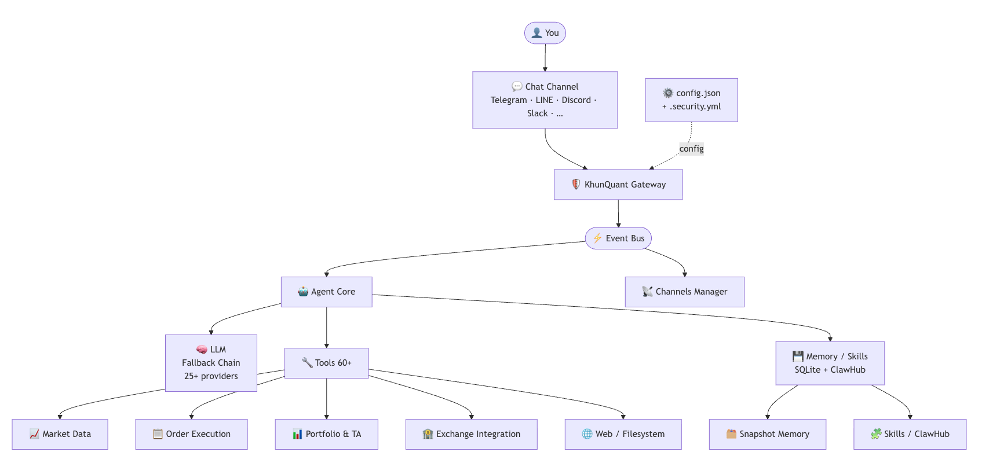

<div align="center">

<table border="0" cellspacing="0" cellpadding="0"><tr>
<td></td>
<td>&nbsp;&nbsp;<h1>KhunQuant</h1></td>
</tr></table>

[](LICENSE)
[](https://goreportcard.com/report/github.com/cryptoquantumwave/khunquant)
[](go.mod)
[](https://github.com/cryptoquantumwave/khunquant/releases)
[](https://github.com/cryptoquantumwave/khunquant/issues)

**Open-source agentic framework for personal AI portfolio management at home — built for the Thai community.**

KhunQuant(คุณควอนต์) connect Thai equity markets (SET) and global digital assets through a single AI-powered orchestrator.
All logic runs locally — your API keys and strategy parameters never leave your machine.

[Report Bug](https://github.com/cryptoquantumwave/khunquant/issues) · [Request Feature](https://github.com/cryptoquantumwave/khunquant/issues) · [Documentation](https://github.com/cryptoquantumwave/khunquant/wiki) · [Discussions](https://github.com/cryptoquantumwave/khunquant/discussions)

</div>

---

<div align="center">
<table border="0" cellspacing="12" cellpadding="16" width="100%">
<tr>
<td align="center" valign="top" width="25%">
<br>
<strong>⚡ DCA Automation</strong>
<br><br>
Indicator-gated buy/sell plans on any schedule.<br>
Gate on RSI · EMA · MACD · BB · ATR · VWAP.<br>
Tracks average cost and unrealized PnL per plan.
<br><br>
</td>
<td align="center" valign="top" width="25%">
<br>
<strong>🔔 Price &amp; Indicator Alerts</strong>
<br><br>
Set conditions on price or any TA indicator.<br>
Alerts fire through your chat channel of choice —<br>
Telegram, LINE, Discord, and more.
<br><br>
</td>
<td align="center" valign="top" width="25%">
<br>
<strong>📈 PnL Tracking</strong>
<br><br>
Real-time unrealized PnL and VWAP average cost<br>
across all active DCA plans and open positions.<br>
No spreadsheet required.
<br><br>
</td>
<td align="center" valign="top" width="25%">
<br>
<strong>📓 Trade Journal</strong>
<br><br>
Every order, execution, and conversation state<br>
is logged and searchable across sessions.<br>
Ask the agent: <em>"What did I trade last week?"</em>
<br><br>
</td>
</tr>
</table>
</div>

---

## Architecture

<div align="center">
  
</div>

---

## Features

| | |
|---|---|
| **Thai Market Native** | Binance, BinanceTH, Bitkub, OKX, and Settrade (SET equities) in a single agent |
| **Natural Language Trading** | *"Buy ฿5,000 BTC on Bitkub every Monday if RSI < 40"* — no code required |
| **DCA Automation** | Indicator-gated DCA plans (SMA/EMA/RSI/MACD/BB/ATR) with VWAP cost tracking and PnL reporting |
| **60+ Built-in Tools** | Market data, order execution, technical analysis, portfolio management, web search, filesystem, IoT |
| **25+ LLM Providers** | Anthropic Claude, OpenAI, Azure, Ollama, local models — with fallback chain |
| **5 Chat Platforms** | Telegram, LINE, Discord, Slack, WhatsApp and more |
| **Privacy-First** | All logic runs locally — API keys and strategy parameters never leave your machine |
| **Credential Encryption** | AES-256-GCM encryption for `.security.yml` via `khunquant auth encrypt` |
| **Lightweight** | Written in Go — <50 MB RAM, <1 s boot. Runs on a Raspberry Pi |
| **Price & Indicator Alerts** | Trigger notifications on price conditions or technical indicators (RSI, MACD, BB, EMA, and more) |
| **PnL Tracking** | Real-time unrealized PnL, VWAP average cost, and per-plan DCA performance summaries |
| **Trade Journal** | Persistent trade history with execution logs, order records, and searchable snapshots across sessions |
| **Memory Snapshots** | Save and query portfolios asset snapshot state across sessions — searchable snapshot history with summaries |
| **Extensible Skills** | Plugin-style skills framework with ClawHub registry integration |

---

## Installation

### Pre-built Binary

Download the latest release for your platform from [GitHub Releases](https://github.com/cryptoquantumwave/khunquant/releases).

| Platform | File |
|---|---|
| macOS (Apple Silicon) | `khunquant-darwin-arm64.tar.gz` |
| macOS (Intel) | `khunquant-darwin-amd64.tar.gz` |
| Linux (amd64) | `khunquant-linux-amd64.tar.gz` |
| Linux (arm / arm64) | `khunquant-linux-arm.tar.gz` / `khunquant-linux-arm64.tar.gz` |
| Linux (mips / riscv64) | `khunquant-linux-mips.tar.gz` / `khunquant-linux-riscv64.tar.gz` |
| Windows | `khunquant-linux-amd64.tar.gz` (WSL2) |

```bash
tar -xzf khunquant-*.tar.gz
mv khunquant /usr/local/bin/
khunquant --version
```

### Build from Source

**Requirements:** Go 1.22+, `make`

```bash
git clone https://github.com/cryptoquantumwave/khunquant.git
cd khunquant
make install          # compiles and installs to /usr/local/bin
khunquant onboard     # interactive setup wizard
```

### Web Console

```bash
cd web
make dev              # frontend → localhost:5173  |  backend → localhost:18800
```

### Docker

```bash
make docker-build     # Alpine-based minimal image
make docker-run       # Run gateway in Docker
```

### Uninstall

```bash
make uninstall        # removes binary and optionally ~/.khunquant/
```

---

## Configuration

KhunQuant separates structure from secrets:

```
~/.khunquant/
├── config.json       ← feature flags and model routing (safe to version control)
└── .security.yml     ← all API keys and credentials (never commit this)
```

Credentials in `.security.yml` support four resolution formats:

| Format | Example | Behaviour |
|---|---|---|
| plain | `sk-ant-abc123` | Used as-is |
| `enc://` | `enc://AgBx9k...` | Decrypted at startup (AES-256-GCM) |
| `env://` | `env://ANTHROPIC_API_KEY` | Read from environment variable |
| `file://` | `file:///run/secrets/key` | Read from file path |

Example `.security.yml`:

```yaml
model_list:
  - model_name: claude
    api_key: env://ANTHROPIC_API_KEY

channels:
  telegram:
    token: env://TELEGRAM_BOT_TOKEN

exchanges:
  binance:
    api_key: env://BINANCE_API_KEY
    secret: env://BINANCE_SECRET
  bitkub:
    api_key: env://BITKUB_API_KEY
    secret: env://BITKUB_SECRET
  settrade:
    api_key: env://SETTRADE_API_KEY
    secret: env://SETTRADE_SECRET
```

Encrypt all credentials at rest:

```bash
khunquant auth encrypt
```

---

## Exchanges

| Exchange | Market | Config Key |
|---|---|---|
| [Binance](https://www.binance.com) | Crypto — Global | `binance` |
| [BinanceTH](https://www.binance.th) | Crypto — Thailand (THB pairs) | `binanceth` |
| [Bitkub](https://www.bitkub.com) | Crypto — Thailand | `bitkub` |
| [OKX](https://www.okx.com) | Crypto — Global | `okx` |
| [Settrade](https://www.settrade.com) | Thai Equities (SET) | `settrade` |

See [Exchange API Credentials](https://github.com/cryptoquantumwave/khunquant/wiki) for step-by-step setup guides for each exchange.

---

## Chat Platforms

Connect KhunQuant to any of 16 supported platforms by adding the relevant section to `config.json`:

Telegram · LINE · Discord · Slack · WhatsApp 

---

## Project Structure

```
cmd/khunquant/          CLI entry point — onboard, agent, gateway, auth, status, cron
pkg/
  agent/               Core agent loop, context management, memory
  providers/           LLM provider abstraction — 25+ backends, FallbackChain
  channels/            Chat platform adapters — 16 platforms
  tools/               60+ tools: market data, orders, TA, DCA, filesystem, IoT
  dca/                 DCA plans, indicator-gated triggers, cron execution, PnL
  exchanges/           BinanceTH / Bitkub / OKX / Binance / Settrade adapters
  credential/          AES-256-GCM encryption for .security.yml
  skills/              Skills framework + ClawHub registry
  config/              Config struct, SecureString, migration
  memory/              JSONL session history + SQLite snapshots
  mcp/                 Model Context Protocol server support
web/                   Vue.js + Vite frontend with embedded Go backend
```

---

## Development

```bash
make check            # Full pre-commit check (fmt + vet + test)
make test             # Run all tests
make lint             # Run golangci-lint
make build-all        # Cross-compile for all platforms
make build-pi-zero    # Raspberry Pi Zero 2 W target
```

Run a single test:

```bash
go test ./pkg/agent/... -run TestName
```

---

## Contributing

Contributions are welcome. Please read [CONTRIBUTING.md](CONTRIBUTING.md) before submitting a pull request.

1. Fork the repository
2. Create a feature branch (`git checkout -b feat/my-feature`)
3. Commit your changes following [Conventional Commits](https://www.conventionalcommits.org/)
4. Open a pull request

---

## License

MIT — see [LICENSE](LICENSE).

Based on [sipeed/picoclaw](https://github.com/sipeed/picoclaw) (MIT License).
Modifications and additional code by KhunQuant contributors (MIT License).

---

<div align="center">

<table border="0" cellspacing="0" cellpadding="12" width="100%">
<tr>
<td align="center">
<strong><a href="https://github.com/cryptoquantumwave/khunquant">github.com/cryptoquantumwave/khunquant</a></strong>
<br><br>
<a href="https://www.facebook.com/cryptoquantumwave/">Facebook</a>
&nbsp;·&nbsp;
<a href="mailto:support@cryptoquantumwave.com">support@cryptoquantumwave.com</a>
<br><br>
Copyright &copy; 2026 <strong>CryptoQuantumWave Team</strong>. Released under the MIT License.
</td>
</tr>
</table>

</div>


